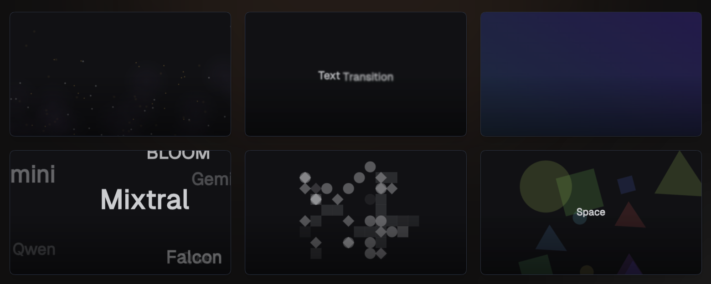

https://github.com/user-attachments/assets/2a5760fe-1886-4490-9c2b-aceec24aff2f




Remotion Bits is a comprehensive collection of animation components and utilities designed specifically for [Remotion](https://www.remotion.dev/) video projects. It provides ready-made, composable components for common animation needs: text effects, gradient transitions, particle systems, 3D scenes, and more. It also includes lower-level utilities for advanced motion and color handling.

> [!NOTE]
> This project is not affiliated with or endorsed by the [Remotion](https://www.remotion.dev/) team.

## Installation

```bash
npm install remotion-bits
```

## Install with jsrepo

The registry is published as a jsrepo registry at:

```
https://unpkg.com/remotion-bits/registry.json
```

### Initialize the registry

```bash
npx jsrepo init https://unpkg.com/remotion-bits/registry.json
```

### Add a component or utility

```bash
npx jsrepo add animated-text
npx jsrepo add particle-system
npx jsrepo add color
```

### One-off add without init

```bash
npx jsrepo add --registry https://unpkg.com/remotion-bits/registry.json animated-text
npx jsrepo add --registry https://unpkg.com/remotion-bits/registry.json particle-system
```

## Contributing

1. Fork the repo and create your branch from `main`.
2. Make changes with clear commit messages.
3. Ensure the build and tests (if any) pass.
4. Open a pull request describing your changes.

## License

MIT
