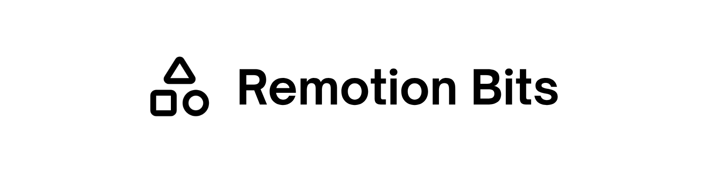

Remotion Bits is a comprehensive collection of animation components and utilities designed specifically for Remotion video projects. It provides ready-made, composable components for common animation needs: text effects, gradient transitions, particle systems, 3D scenes, and more. It also includes lower-level utilities for advanced motion and color handling.

Using jsrepo, components are copied directly into your project so you can customize them, and updates are managed over time. This approach (similar to shadcn/ui) gives you full ownership of the code while maintaining the ability to receive improvements.

## Installation

```bash
npm install remotion-bits
```

## Install with jsrepo (recommended)

The registry is published as a jsrepo registry at:

```
https://unpkg.com/remotion-bits/registry.json
```

### Initialize the registry

```bash
npx jsrepo init https://unpkg.com/remotion-bits/registry.json
```

### Add a component or utility

```bash
npx jsrepo add animated-text
npx jsrepo add particle-system
npx jsrepo add color
```

### One-off add without init

```bash
npx jsrepo add --registry https://unpkg.com/remotion-bits/registry.json animated-text
npx jsrepo add --registry https://unpkg.com/remotion-bits/registry.json particle-system
```

## Local registry usage (this repo)

When testing against a local checkout, build the registry and use the `fs` provider. A plain filesystem path like `/home/everlier/code/remotion-bits/registry.json` will fail with “A provider for this registry was not found.”

```bash
npm run registry:build
```

Add the `fs` provider in your project’s jsrepo config:

```ts
import { defineConfig } from "jsrepo";
import { fs } from "jsrepo/providers";

export default defineConfig({
  providers: [fs()],
});
```

Then initialize jsrepo with the `fs://` registry path:

```bash
npx jsrepo init fs:///home/everlier/code/remotion-bits/registry.json
```

```bash
npx jsrepo add animated-text
```

## Available components

### Main Components

- `animated-text` - Character-by-character, word-by-word, or full text animations with staggering, easing, and transform controls
- `gradient-transition` - Smooth CSS gradient transitions with intelligent interpolation (linear, radial, conic)
- `staggered-motion` - Advanced motion and transform animations for child elements with stagger effects and directional timing
- `particle-system` - Complete particle effect system with spawners, behaviors (gravity, drag, wiggle, scale, opacity), and deterministic simulation
- `scene-3d` - 3D scene rendering with camera controls, steps, elements, and smooth transitions

### Utilities

- `interpolate` - Custom interpolation function with easing support and non-monotonic input ranges
- `color` - Perceptually uniform color interpolation using Oklch color space
- `gradient` - CSS gradient parser and interpolation with Granim.js-inspired mathematics
- `motion` - Keyframe interpolation, easing, transform and style building, and motion timing calculations
- `geometry` - Geometric calculations including Rect class with viewport units (vh, vw, vmin, vmax)
- `random` - Random value generation utilities
- `particles-utilities` - Core particle system infrastructure with types, behaviors, and deterministic simulation

### Hooks

- `use-viewport-rect` - Hook to get the current video composition's viewport rectangle

## Demo Playground

An interactive playground is available to preview and test all components with real-time property tweaking.

### Run the demo

```bash
cd demo
npm install
npm start
```

This opens Remotion Studio where you can:
- Preview the components in action
- Adjust component properties using the controls panel
- See changes instantly without reloading
- Render the demo video

See [demo/README.md](demo/README.md) for more details on available properties and customization options.

## Default install path

By default, components are added to `src/components`. You can change this in your project’s jsrepo config by setting the `paths.component` value.

## Library usage example import

When using remotion-bits as a library:

```ts
import { AnimatedText, GradientTransition, ParticleSystem, Scene3D, StaggeredMotion } from "remotion-bits";
import { interpolate, color, gradient } from "remotion-bits";
import { useViewportRect } from "remotion-bits";
```

If you installed components into your project via jsrepo, you can import from your local files, for example:

```ts
import { AnimatedText } from "./components/AnimatedText";
import { interpolate } from "./utils/interpolate";
import { useViewportRect } from "./hooks/useViewportRect";
```

## Directory structure

After installing components and utilities into your project, you will typically have:

```
src/
	components/
		AnimatedText.tsx
		GradientTransition.tsx
		ParticleSystem/
			Particles.tsx
			Spawner.tsx
			Behavior.tsx
			index.ts
		Scene3D/
			Scene3D.tsx
			Step.tsx
			Element3D.tsx
			context.ts
			types.ts
			index.ts
	utils/
		interpolate.ts
		color.ts
		gradient.ts
		motion/
			index.ts
		geometry.ts
		random.ts
		particles/
			types.ts
			behaviors.ts
			simulator.ts
			index.ts
	hooks/
		useViewportRect.ts
```

## Registry build output (maintainers)

The registry JSON is generated via the repository output and published at the root as registry.json. Build it before publishing:

```bash
npm run registry:build
```

## Contributing

1. Fork the repo and create your branch from `main`.
2. Make changes with clear commit messages.
3. Ensure the build and tests (if any) pass.
4. Open a pull request describing your changes.

## License

MIT
